# Printer Mechanism Installation SOP

> **Note:** Each "station" refers to an operator workstation containing one or more steps. Torque values are specified in kgf-cm with upper and lower limits.

---

## **Station 1**

1. Remove the printer mechanism assembly from the red plastic bag. Turn the blue rotary knob on the mechanism to detach the cardboard and the mechanism paper feed roller assembly. Discard the cardboard.
   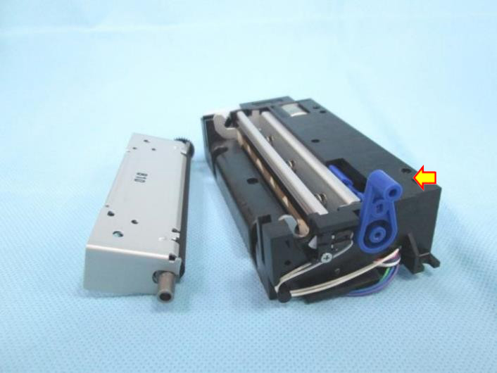
2. Place the mechanism onto the cutter mechanism mounting bracket, aligning the 3 screw holes. Fasten the screws.  
   *(Torque: 6 kgf-cm / upper-lower limit: 5.8~6.2 kgf-cm)*  
   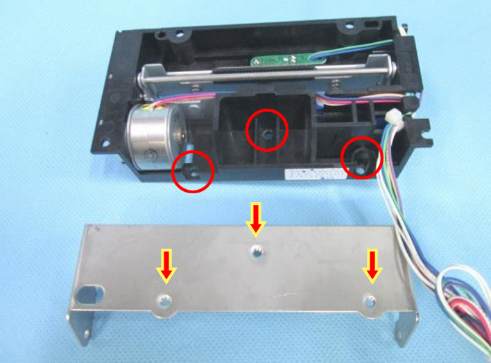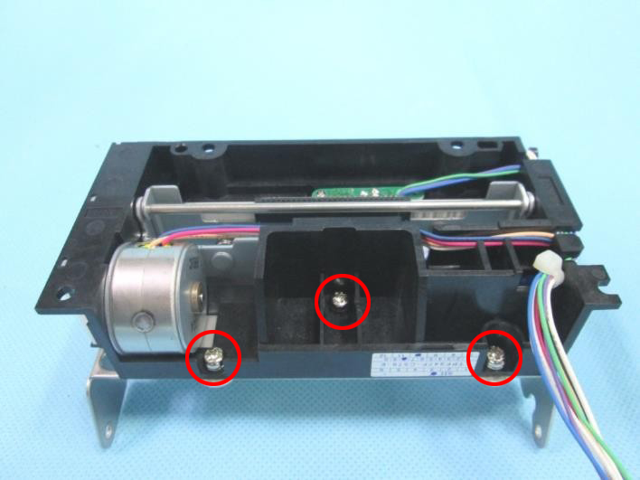

---

## **Station 2**

1. Remove the SENSOR board from the mechanism completed in Station 1.  
   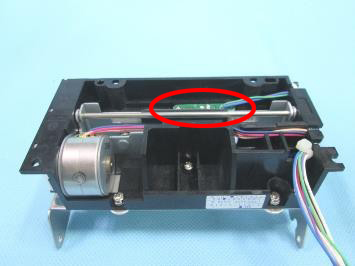
2. Remove the black protective cover from the SENSOR board.  
   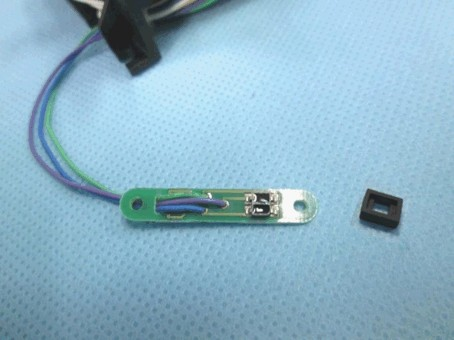
3. Using the 2 screws from the SENSOR board, mount the SENSOR board onto the paper guide plate.  
   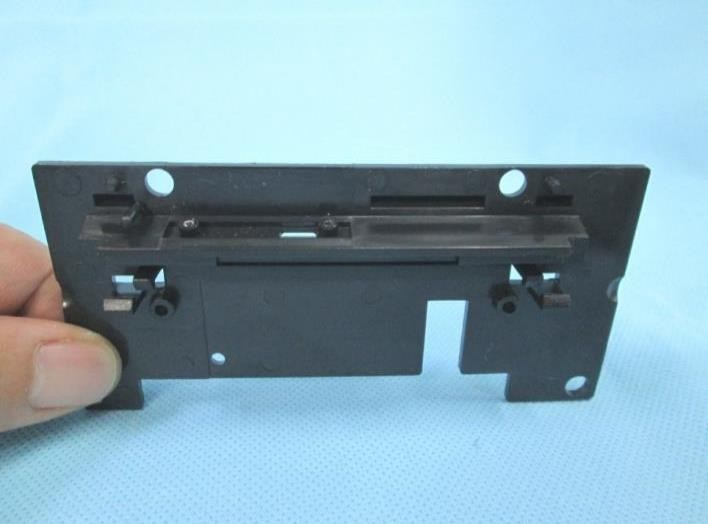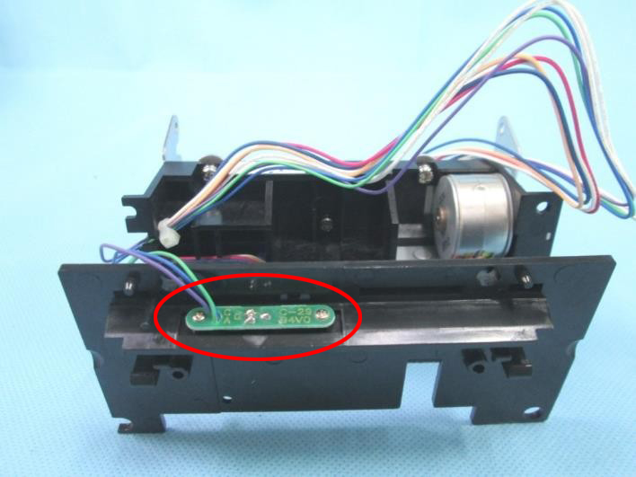

---

## **Station 3**

1. Cut a 2 cm length of cotton tape and use it to secure the 9 mechanism wires from the Station 2 assembly at the indicated position.  
   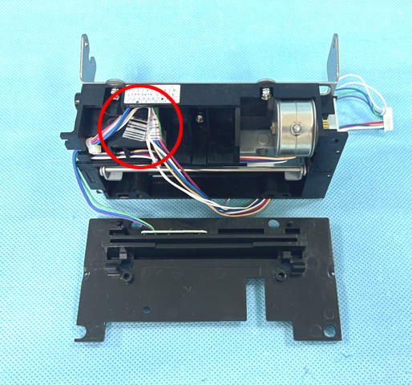
2. (①) Insert the 28P flat cable with the copper foil side facing the slot contacts. (②) Route the SENSOR wires (blue, green, purple) into the left-side groove as indicated by the dashed line.  
   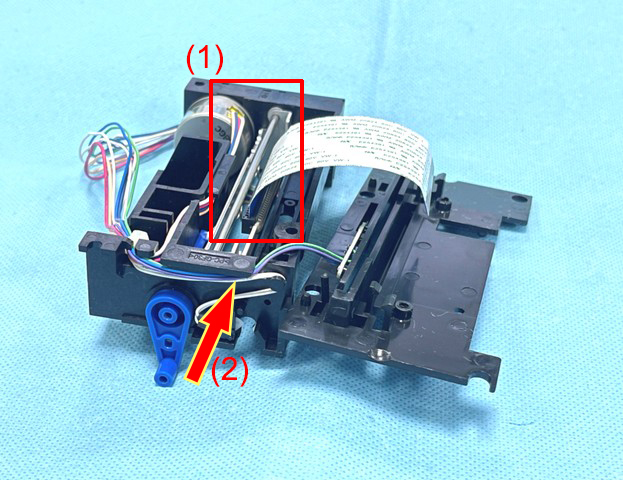
3. (①) Further route the SENSOR wires (blue, green, purple) into the long rib column. (②) Align the paper guide plate with the left and right positioning holes on the mechanism, then press down, ensuring not to pinch the SENSOR wires.  
   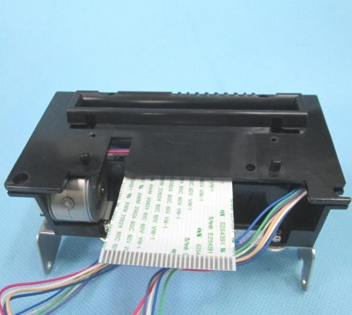

---

## **Station 4**

1. (①) Arrange the mechanism wires neatly and secure with a cable tie. (②) Use cloth with alcohol to clean the cutter mechanism mounting bracket.  
   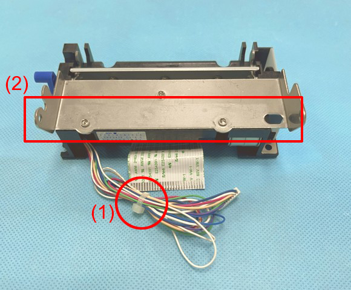
2. Take the wire cover Mylar sheet, peel off the backing adhesive, and (①) align it to the far left side of the metal bracket. (②) Align with the crease and tooth cutouts on the Mylar sheet, then press flat.  
   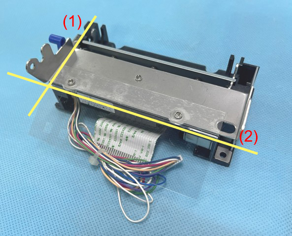
3. Peel off the transparent protective film from the Mylar sheet.  
   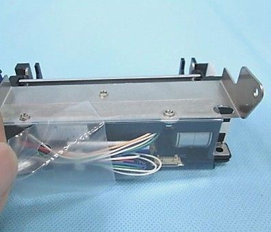

---

## **Station 5**

1. Take the Station 4 assembly and connect:  
   (①) 28P flat cable to CN1, (②) mechanism connection cable to CN3, (③) 7P connection cable to CN7 on the connection board.  
   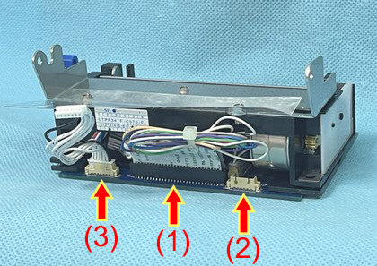
2. Flip the assembly over and confirm that the mechanism positioning pin fits into the hole on the connection board. Fasten 2 black screws below the hole.  
   *(Torque: 3.2 kgf-cm / upper-lower limit: 3~3.4 kgf-cm)*  
   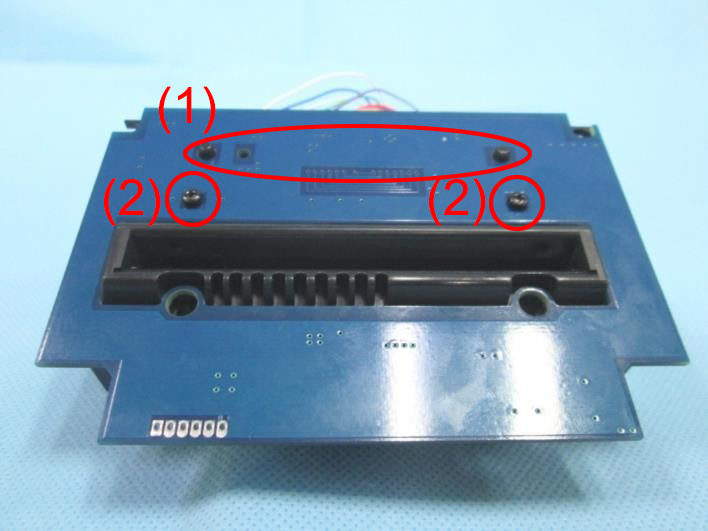
3. Stand the mechanism assembly upright, place the black plastic knob over the blue rotary knob on the assembly, and fasten 1 black round-head self-tapping screw.  
   *(Torque: 3.2 kgf-cm / upper-lower limit: 3~3.4 kgf-cm)*  
   

---

## **Station 6**

1. Take the Station 5 assembly and connect the 4P, 6P, 9P cables, and 28P flat cable to CN2, CN4, CN6, and CN8 respectively on the connection board.  
   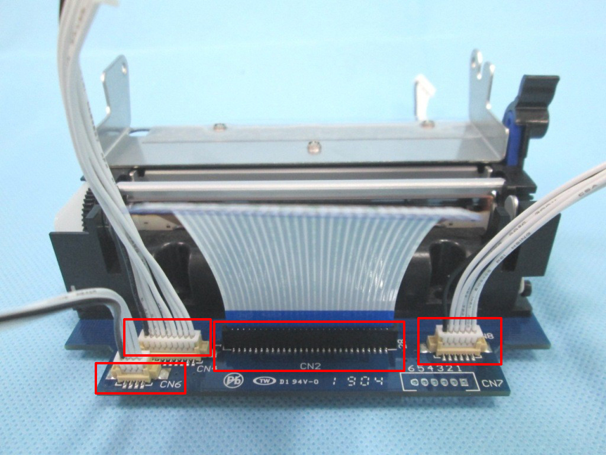

---

## **Station 7**

1. Following the diagram, mount the SENSOR board onto the cutter frame bracket with 2 flat-head screws.  
   *(Torque: 3.2 kgf-cm / upper-lower limit: 3~3.4 kgf-cm)*  
   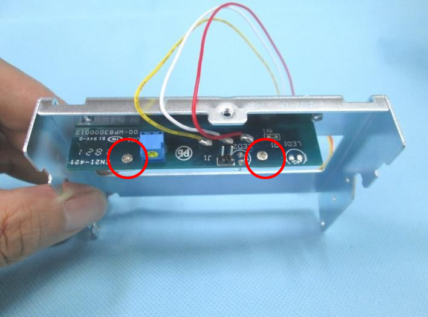
2. Route the SENSOR cable over the variable resistor and screw hole, along the frame edge to the lower left corner.  
   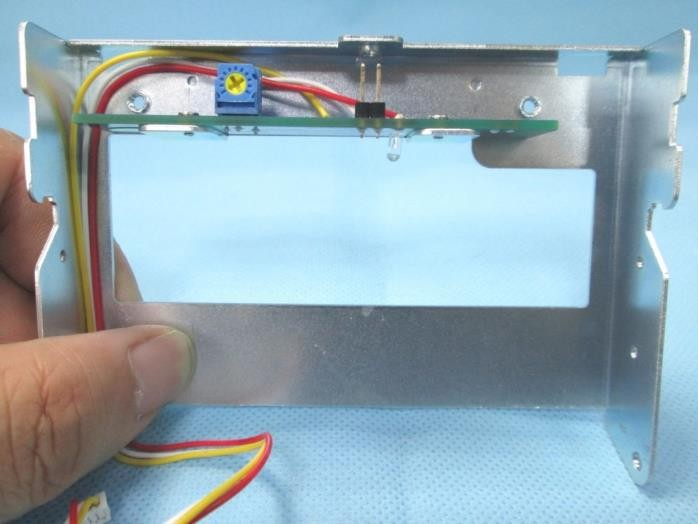
3. Using 2–3 cm cotton tape, secure the SENSOR cable to the right-angle edge of the bracket as shown.  
   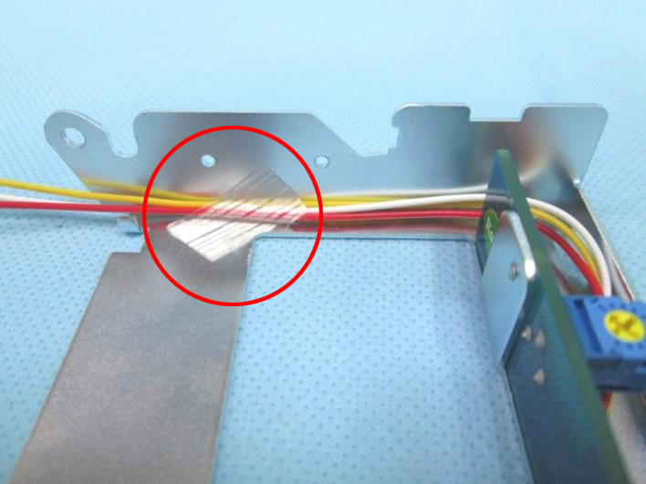

---

## **Station 8**

1. Using diagonal pliers, cut a bevel on the front right edge of the black plastic paper exit of the cutter.  
   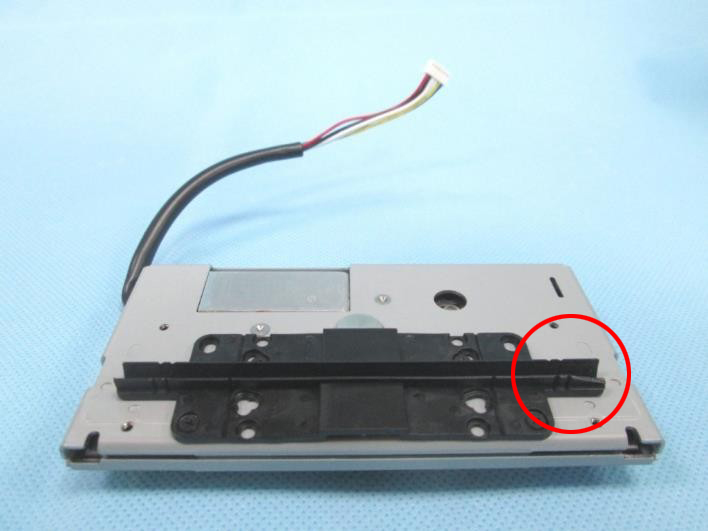
2. Take the Station 7 assembly and slide the cutter in the arrow direction, avoiding contact with the transparent LED lamp. Align the cutter cable with the cable groove on the metal bracket.  
   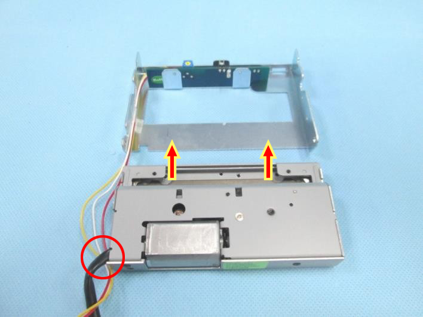
3. Fasten 2 screws on the left and right sides of the assembly.  
   *(Torque: 3.2 kgf-cm / upper-lower limit: 3~3.4 kgf-cm)*  
   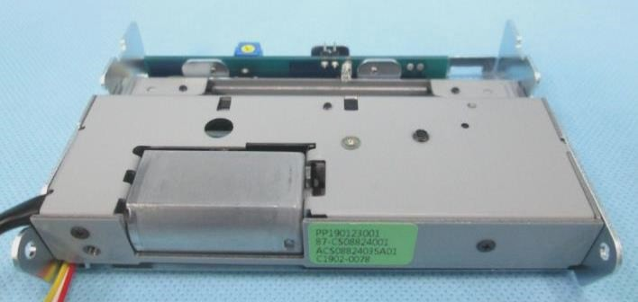

---

## **Station 9**

1. Apply the paper exit Mylar sheet to the paper exit cover, ensuring the non-adhesive parts align with the two notches in the cover.  
   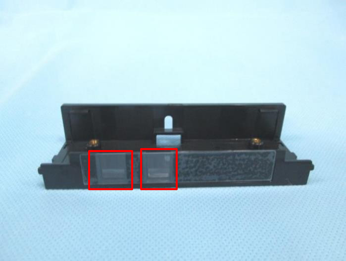
2. Peel off the protective film from the Mylar sheet.  
   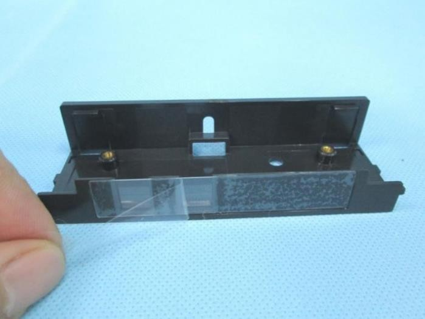
3. Attach the paper exit cover from back to front onto the cutter frame, aligning the left and right grooves. Press both ends evenly, then fasten 1 truss-head screw at the bottom front.  
   *(Torque: 6 kgf-cm / upper-lower limit: 5.8~6.2 kgf-cm)*  
   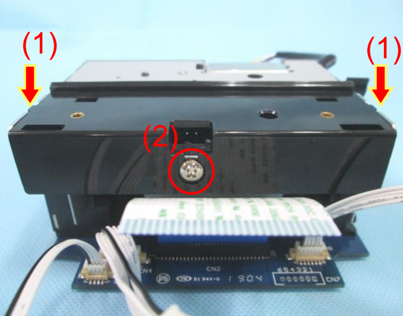

---

## **Station 10**

1. Take the Station 9 assembly and align the mechanism paper feed roller assembly with the positioning points. Fasten with 2 truss-head screws.  
   *(Torque: 6 kgf-cm / upper-lower limit: 5.8~6.2 kgf-cm)*  
   

---

## **Station 11**

1. Take the Station 10 assembly and, as indicated, press the roller downward to lock it onto the mechanism roller latch on the Station 6 assembly.  
   
2. Insert the cutter shaft through the cutter frame and mechanism mounting bracket. At the left and right cutter shaft grooves, attach E-clips using an auxiliary tool.  
   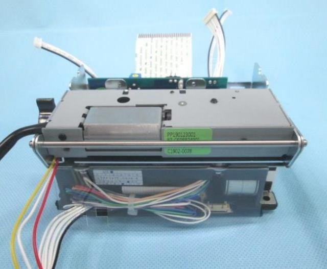

---

## **Station 12**

1. Place the Station 10 assembly onto the positioning holes of the mechanism frame bracket.  
   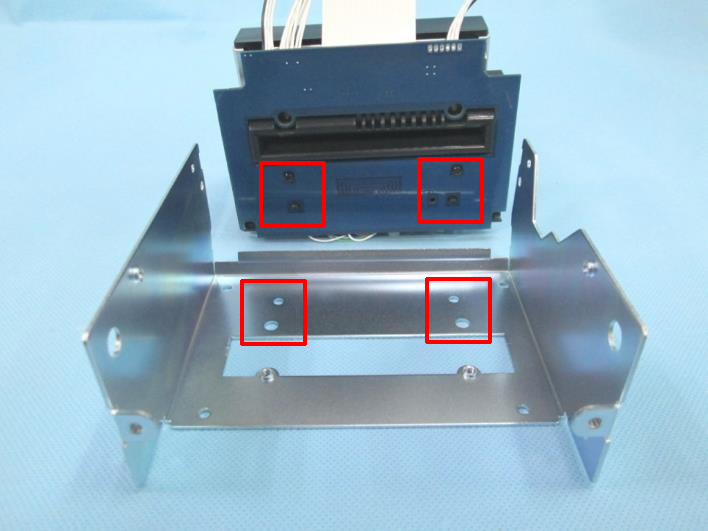
2. Check the back side to ensure the bracket’s positioning points and screw locations align with the positioning holes.  
   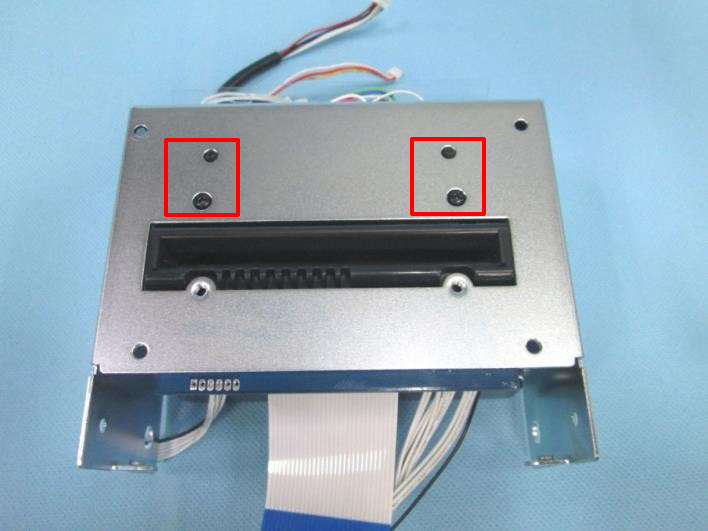
3. Turn the mechanism rotary knob to open the cutter assembly, then fasten 2 small round-head screws onto the mechanism assembly. Close the cutter assembly afterward.  
   *(Torque: 6 kgf-cm / upper-lower limit: 5.8~6.2 kgf-cm)*  
   

---

## **Station 13**

1. Route the cutter cable along the frame edge in an L-shape and connect it to CN5 on the connection board. Insert the cable into the frame.  
   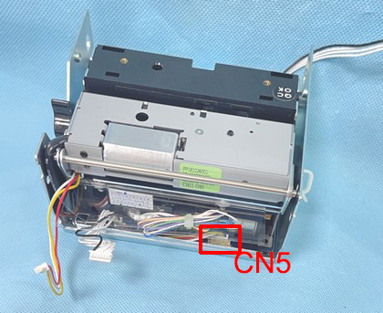
2. Route the 7P signal cable out through the "b" notch.  
   
3. Pass the cutter SENSOR cable (red, white, yellow) through the "a" notch, then out the "b" notch. Finally, insert the transparent Mylar sheet into the mechanism frame.  
   

---

## **Station 14**

1. Install the keyboard board onto the keyboard frame bracket.  
   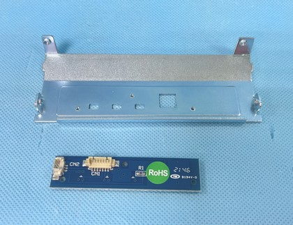
2. Fasten with 3 flat-head screws.  
   *(Torque: 3.2 kgf-cm / upper-lower limit: 3~3.4 kgf-cm)*  
   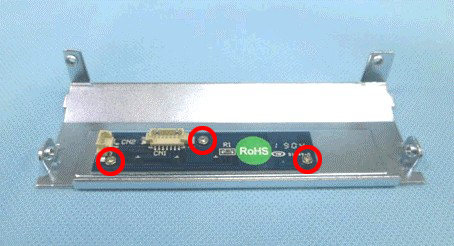

---

## **Station 15**

1. Install the Station 14 assembly onto the Station 13 assembly, aligning the left and right screw holes on the bracket. Secure with 2 countersunk machine screws.  
   *(Torque: 3.2 kgf-cm / upper-lower limit: 3~3.4 kgf-cm)*  
   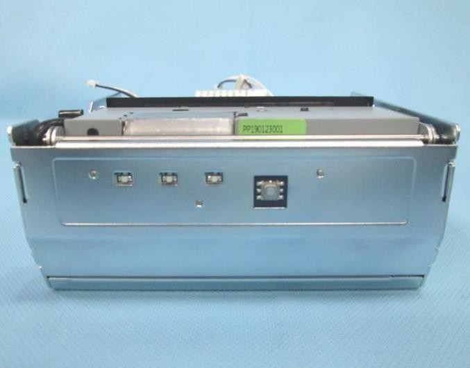
2. Turn to the front side and, as shown, fasten 2 truss-head machine screws at the upper left and right positions.  
   *(Torque: 6 kgf-cm / upper-lower limit: 5.8~6.2 kgf-cm)*  
   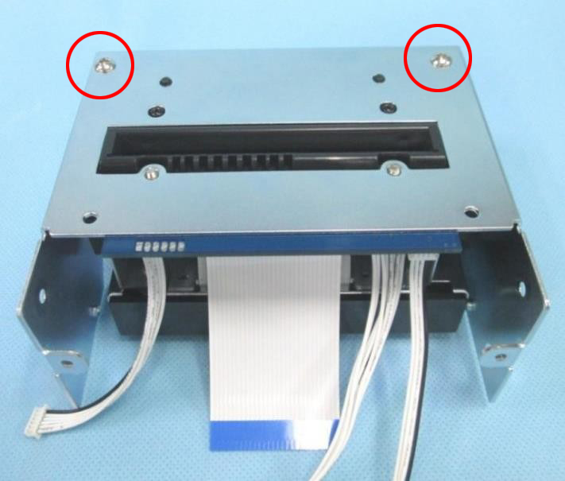

---

## **Station 16**

1. Take the Station 15 assembly, stand it upright as shown, and fit it into the front end of the PCB metal housing. Fasten 1 countersunk screw on each lower left and right side.  
   *(Torque: 3.2 kgf-cm / upper-lower limit: 3~3.4 kgf-cm)*  
   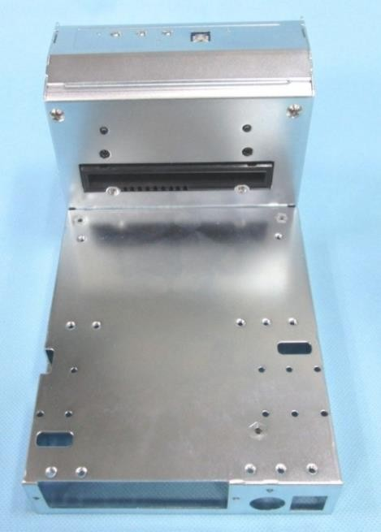
2. Rotate the mechanism assembly to the front, turn the rotary knob to open the cutter assembly, and fasten 2 small round-head screws on the left and right of the connection board to secure the mechanism to the PCB metal housing. Close the cutter assembly afterward.  
   *(Torque: 6 kgf-cm / upper-lower limit: 5.8~6.2 kgf-cm)*  
   
